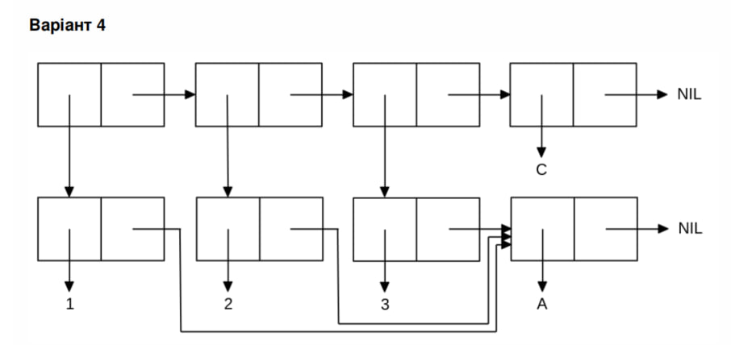

<p align="center"><b>МОНУ НТУУ КПІ ім. Ігоря Сікорського ФПМ СПіСКС</b></p>
<p align="center">
<b>Звіт з лабораторної роботи 1</b><br/>
"Обробка списків з використанням базових функцій"<br/>
дисципліни "Вступ до функціонального програмування"
</p>

<p align="right"> 
<b>Студент</b>: 
<em> Лабазов Володимир КВ-11</em></p>

<p align="right"><b>Рік</b>: <em>2025</em></p>


## Загальне завдання
```lisp
;; Пункт 1 (створення списку)
CL-USER> (setq things (list 'abc 15 '(n i r) '() 16))
(ABC 15 (N I R) NIL 16)

;; Пункт 2 (отримання голови списку)
CL-USER> (car things)
ABC

;; Пункт 3 (отримання хвоста списку)
CL-USER> (cdr things)
(15 (N I R) NIL 16)

;; Пункт 4 (отримання третього елемента списку)
CL-USER> (third things)
(N I R)

;; Пункт 5 (отримання останнього елемента списку)
CL-USER> (last things)
(16)

;; Пункт 6 (Використання предикатів ATOM та LISTP)
;;ATOM
CL-USER> (atom (first things))
T
CL-USER> (atom (third things))
NIL

;;LISTP
CL-USER> (listp (first things))
NIL
CL-USER> (listp (third things))
T

;; Пункт 7 (Використання інших предикатів)
;;EQUAL
CL-USER> (equal (second things) (car (last things)))
NIL
CL-USER> (equal (car things) (car (last things)))
NIL

;;NUMBERP
CL-USER> (numberp (second things))
T
CL-USER> (numberp (car things))
NIL

;;null
CL-USER> (null (car things))
NIL
CL-USER> (null (fourth things))
T

;; Пункт 8 (Об'єднання списку із підсписком)
CL-USER> (append (third things) things)
(N I R ABC 15 (N I R) NIL 16)
```

## Варіант 4
<p align="center"></p>

### Лістинг команди конструювання списку та результат її виконанння
```lisp
CL-USER> (
          let ((x (list 3 'a)))
          (list (cons 1 (cdr x)) (cons 2 (cdr x)) x 'C) 
         )
((1 A) (2 A) (3 A) C)
```

